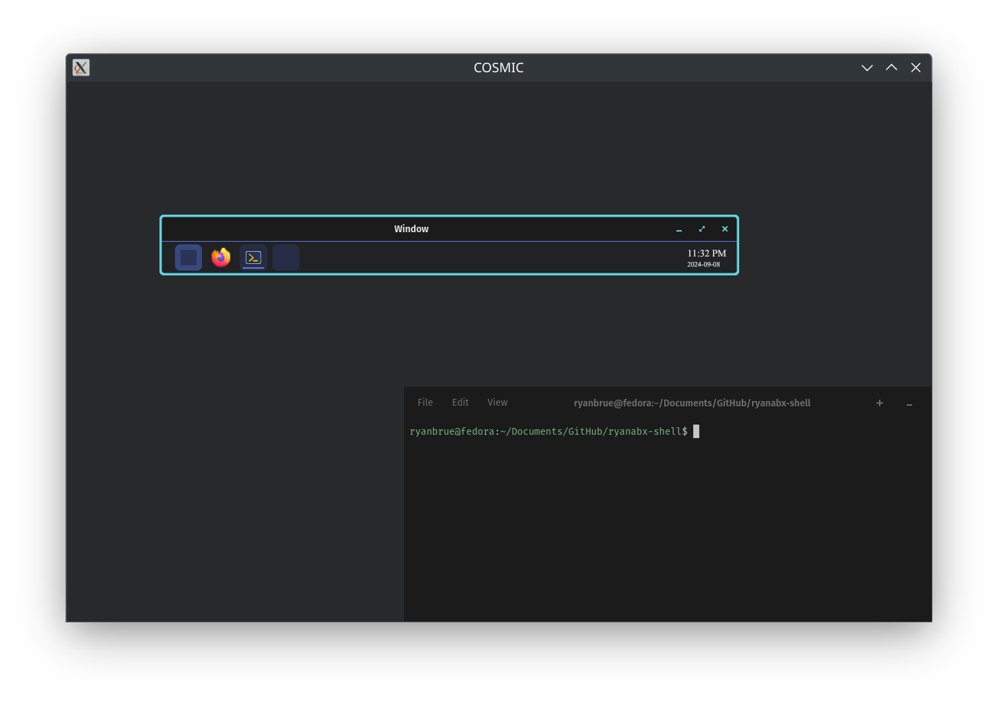

# rbshell

A compositor-agnostic desktop shell!

> NOTE: This project is under heavy development, and will probably not be "stable" for a while.

Welcome to a desktop shell that's intended to run on any compositor! To be more specific, this would be any compositor that implements `wlr-layer-shell`. The rest of the wayland backend stuff is implemented per-backend.

The currently planned backends to be supported are:

- [cosmic-comp](https://github.com/pop-os/cosmic-comp) (First primary target)
- [KWin](https://invent.kde.org/plasma/kwin)
- [Wlroots-based compositors](https://gitlab.freedesktop.org/wlroots/wlroots)
- Your compositor?

This shell is intended to be similar to Windows-style desktops, with a launcher in the bottom left, a list of favorite apps in the middle or left (configurable), and a tray with settings on the right! The designs aren't fully finished at the moment, but that's the general direction I'd like to go.

The shell is proudly built entirely in [Rust!](https://www.rust-lang.org/)

## Very early screenshot



## Build instructions (Ubuntu/Fedora instructions)

```shell
# Install Dependencies (Ubuntu)
sudo apt-get install -y libxkbcommon-dev
# Install Dependencies (Fedora)
sudo dnf install -y libxkbcommon-devel
# Build
cargo build
```

## Contributing

The first thing you should do if you'd like to contribute is [submit an issue](https://github.com/ryanabx/rbshell/issues/new) describing the feature you'd like to implement. This helps to avoid potential duplicate work if I'm already working on such a feature!

Also check out the [issues](https://github.com/ryanabx/rbshell/issues) I've written out, as that will give an idea of the roadmap I'm looking at!

## License

This work is licensed under the [MIT License](LICENSE)